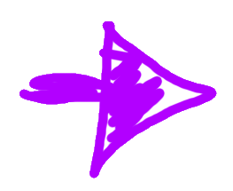

class: center
name: title
count: false

# a MIR Formality

.p60[]

.me[.grey[*by* **Nicholas Matsakis**]]
.left[.citation[View slides at `https://nikomatsakis.github.io/hilt-2022/`]]

---

What is...

# a MIR Formality

?

---

# From the repository...

> This repository is an **early-stage experimental project** that aims to be a **complete, authoritative formal model** of the Rust MIR. Presuming these experiments bear fruit, the intention is to bring this model into Rust as an RFC and develop it as an **official part of the language definition**.

(emphasis mine)

---

What is...

# a MIR Formality

More concretely:

* executable, implemented in PLT Redex<sup>1</sup>
* front-end that parses Rust and generates tests
* available at https://github.com/nikomatsakis/a-mir-formality

.footnote[<sup>1</sup> More on this later.]

---

# Why a MIR Formality?

* Complexity of Rust language has reached a tipping point
* Prototyping tool
* Enable formal methods tooling

---

What is...

# MIR

---

# Implications of using MIR

Excludes:

* Parser, surface grammar
* Name resolution, macro expansion, hygiene
* Many details of type inference

Includes:

* Type checking
* Subtyping and coercions
* Trait resolution
* Borrow checking
* Const generics, const evaluation

---

# Stable MIR project

Goal:

Define a stable interface to MIR for advanced tooling

---

# MiniRust

Partner project: [MiniRust] gives operational semantics

In particular, defining what actions are permitted by unsafe code.

[MiniRust]: https://github.com/RalfJung/minirust

---

# A tour of a-mir-formality

---

Programs begin in the...

# Rust layer

---

# Example in Rust

```rust
trait Debug {...}

impl<T: Debug> Debug for Data<T> {...}

struct Data<T> { data: T }
```

---

# Rust primer: traits

```rust
trait Debug {
    fn fmt(&self, ...);
}
```

---

# Rust primer: generics

```rust
trait Debug { ... }

fn print<T: Debug>(t: &T) {
    t.fmt(...);
}
```

.line3[]

---

# Rust primer

```rust
trait Debug {...}
fn print<T: Debug>(t: &T) {...}

fn test() {
    print(&22);
}
```

.line5[]

---

# Rust primer

```rust
trait Debug {...}
fn print<T: Debug>(t: &T) {...}

fn test() {
    print::<i32>(&22);
}
```

.line5[]

--

in libstd...

```rust
impl Debug for i32 {..}
```

---

# Rust primer

```rust
trait Debug {...}
fn print<T: Debug>(t: &T) {...}

struct Data<T> { data: T }

fn test() {
    print::<Data<i32>>(&Data { data: 22 });
}
```

.line4[]

---

# Rust primer

```rust
trait Debug {...}
fn print<T: Debug>(t: &T) {...}

struct Data<T> { data: T }

fn test() {
    print::<Data<i32>>(&Data { data: 22 });
}
```

.line6[]

--

in library...

```rust
impl<T: Debug> Debug for Data<T> { }
```

in libstd...

```rust
impl Debug for i32 { }
```

---

# Rust primer: generic traits

```rust
trait PartialEq<T> {
    fn eq(&self, t: &T) -> bool;
}

impl PartialEq<i64> for i32 {...}
impl PartialEq<i32> for i32 {...}
```

---

# Example in Rust

```rust
trait Debug {...}

impl<T: Debug> Debug for Data<T> {...}

struct Data<T> { data: T }
```

---

name: plt-redex

# Example in PLT Redex

```scheme
(crate A {
    ; trait Debug { }
    (trait Debug[] where [] { })

    ; impl<T: Debug> Debug for Data<T>
    (impl[(type T)] Debug[] for (Data < T >) where [(T : Debug)] {})

    ; struct Data<T> { }
    (struct Data[(type T)] where [] { (data : T)})
})
```

---

template: plt-redex

.line3s[]

---

template: plt-redex

.line6s[]

---

template: plt-redex

.line9s[]


---

# Automated generation

```bash
> cargo run -- --print input.rs
(crate A {
    ; trait Debug { }
    (trait Debug[] where [] { })

    ; impl<T: Debug> Debug for Data<T>
    (impl[(type T)] Debug[] for (Data < T >) where [(T : Debug)] {})

    ; struct Data<T> { }
    (struct Data[(type T)] where [] { (data : T)})
})
```

.footnote[
    Actually the output is much messier. But you get the idea.
]

---

Programs begin in the **Rust layer**...

--

...and get transformed to the...

# Decl layer

---

# Decl layer: structs

```scheme
(struct Foo[(type T)] where [] { (data : T) })
```

```scheme
(struct Foo[(type T)] where [] {
    (Foo [(data : T)]) ; 👈
})
```

* Close to surface syntax in most ways
* More uniform

---

# Decl layer

```scheme
(struct Foo[(type T)] where [] {
    (Foo [(data : T)])
})
```

```scheme
(enum Option[(type T)] where [] {
    (Some [(data : T)])
    (None [])                   
})
```

---

# Decl layer: impls (1/3)

```scheme
(impl[(type T)] Debug[] for (Foo < T >) where [(T : Debug)] {})
;               -----------------------
```

```scheme
(impl[(type T)] (Debug [(Foo < T >)]) where [(is-implemented (Debug [T])] {})
;               ---------------------
```

--

Another example of more uniform notation:

```scheme
(TraitRef ::= (TraitId Parameters))

(Parameter ::= Ty Lt)
```

For example, `i32: PartialEq<i64>` would be

```scheme
(PartialEq [i32 i64])
```

---

# Decl layer: impls (2/3)

```scheme
(impl[(type T)] Debug[] for (Foo < T >) where [(T : Debug)] {})
;                                              -----------
```

```scheme
(impl[(type T)] (Debug [(Foo < T >)] where [(is-implemented (Debug [T])] {})
;                                           ---------------------------
```

**Rust where-clauses** become **logical formulae**<sup>1</sup>

.footnote[
    <sup>1</sup> Please forgive me the pretentious, and probably wrong, latin plural here. I've been waiting my whole life to end a word with an `-e`.
]

---

# Logical formulas

Base predicates:

```scheme
(Predicate ::= (is-implemented TraitRef)
               ...
               )
```

More complex things too, like `∀` or `∃`. More on these later.

---

# Decl layer

```scheme
(impl[(type T)] Debug[] for (Foo < T >) where [(T : Debug)] {})
;                           -----------
```

```scheme
(impl[(type T)] (Debug [(rigid-ty Foo [T])] where [(is-implemented (Debug [T])] {})
;                       ------------------
```

**Rust types** become **internal types**

---

# Rust types in the decl layer

```scheme
(Ty ::= RigidTy AliasTy PredicateTy VarId)
```

* **Rigid types:** things like `u32`, `Vec`, or `String`

--
* **Alias types:** associated types like `T::Item`

--
* **Predicate types:** sci-fi types<sup>1</sup> like `∀X. T`, `∃X. T`, or `P => T` .footnote[ These types don't directly exist in Rust. We desugar more complex types to use them. ]

--
* **Variables:** Generic types or inference variables

---

# Decl layer

* Uniform notation
* Rust where clauses expressed as logical formulas
* Rust types broken to their "essence"

---

Programs begin in the **Rust layer**...

...and get transformed to the **Decl layer**...

--

...and then checked by the 

# Check layer

---

# Check layer

* Given a Rust program...
    * Check each item in the crate is well-formed
    * Check coherence: impls don't apply to the same type
    * Check each function body type checks
    * Check each function body passes the borrow check

---

# Type checking

---

# Representing function bodies

```rust
struct Data<T> { value: T }

fn process(mut datum: Data<u32>) {
    datum.value += 1;
    print(datum);
}

fn print<T: Debug>(t: T) {...}
```

---

name: mir

# Rust's MIR

```rust
fn process(_1: Data<u32>) -> () {
    let mut _0: ();
    let mut _2: u32;
    let _3: ();
    let mut _4: Data<u32>;

    bb0: {
        _2 = _1.0 + const 1_u32;                  // _2 = datum.value + 1
        (_1.0: u32) = move _2;                    // datum.value = _2
        _4 = move _1;                             // _4 = datum;
        _3 = print::<Data<u32>>(move _4) -> bb1;  // _3 = print(_4);
    }

    bb1: {
        return;
    }
}
```

---

template: mir

.line1[]

---

template: mir

.arg1[]

---

template: mir

.bb0[]

---

template: mir

.addition[]

---

template: mir

.store[]

---

template: mir

.move41[]

---

template: mir

.movekw[]

---

template: mir

.turbofish[]

---

template: mir

.branchbb1[]

---

Starting from MIR means we don't model a lot...

* Type inference and coercions
* Closure capture
* Exhaustiveness checking in match statements

...but we still model...

* Subtyping rules
* Trait matching
* Borrow checker

---

name: type-checker

# Type checker

```rust
fn process(_1: Data<u32>) -> () {
    ...
    let mut _4: Data<u32>;
    ...
    _3 = print::<Data<u32>>(move _4) -> bb1;  // _3 = print(_4);
    ...
}

fn print<T: Debug>(t: T) { }
```

* Given by MIR:
    * `T = Data<u32>`
* We must check:
---
template:type-checker
    * type of `_4` is a subtype of `Data<u32>`

.subtype4[]
---
template:type-checker
    * type of `_4` is a subtype of `Data<u32>`
    * `Data<u32>` implements `Debug`

.datau32[]
.tdebug[]

---

Programs begin in the **Rust layer**...

...get transformed to the **Decl layer**...

...and then checked by the **Check layer**...

--

which makes queries to the 

# Logic layer

---

# Logic layer

A *query* is a logical goal that must be proven...

```scheme
is_implemented(Debug [(rigid-ty Data [u32])])
```

The result is one of...

* True
* False
* Maybe

---

# Modeling the solver

The model includes the solver algorithm.

Solver is sound and complete<sup>1</sup>, but approximate:

* Sound: if it returns True, then the goal is provable.
* Complete: if it returns False, then the goal is not provable.
* Ambiguous: it may return Maybe.

.footnote[
    <sup>1</sup> Unproven assertion.
]

---

# Obtaining the rules

What does it mean for a goal like ...

```scheme
is_implemented(Debug [(rigid-ty Data [u32])])
```

...to be provable?

---

Programs begin in the **Rust layer**...

...get transformed to the **Decl layer**...

...and then checked by the **Check layer**...

...which makes queries to the **Logic layer**...

...which hooks back to the 

# Decl layer

for axioms.

---

# Generating the axioms

```rust
impl<T: Debug> Debug for Data<T> {...}
```

```prolog
∀T. (
    is_implemented(Data<T>: Debug) :-
        is_implemented(T: Debug)
)
```

in English:

* For any type `T`,
* you can conclude that `is_implemented(Data<T>: Debug)` is true
* if you can prove `is_implemented(T: Debug)`.

.footnote[
    The `P :- Q` operator in Prolog is equivalent to *Q implies P*.
]

---

# Looks a lot like a prolog solver

* Rust declarations *converted into* a set P of logical predicates
    * e.g., `is_implemented(Data<T>: Debug) :- is_implemented(T: Debug)`
* Logic solver determines if goals are provable using P
    * leverages techniques developed for λProlog¹ to support `∧`, `∨`, `∀`, etc

.footnote[¹ "Programming with Higher-Order Logic" by Dale Miller, Gopalan Nadathur]

---

# Coinduction

**Problem:** Cycles and auto traits like `Send`

```rust
struct MyList<T> {
    data: T,
    next: Option<Box<MyList<T>>>
}
```

`MyList<X>` is `Send` if all of reachable data is `Send`. Most obvious formulation has one goal per field:

```rust
∀T. (
    is_implemented(MyList<X>: Send) :-
        is_implemented(T: Send),
        is_implemented(Option<Box<MyList<T>>>: Send)
}
```

---

```rust
∀T. (
    is_implemented(MyList<X>: Send) :-
        is_implemented(T: Send),
        is_implemented(Option<Box<MyList<T>>>: Send)
}
```

But apply that to `MyList<u32>`...

* `MyList<u32>: Send`
--

* `u32: Send` ✅
--

* `Option<Box<MyList<u32>>>: Send`
--

* `Box<MyList<u32>>: Send`
--

* `MyList<u32>: Send` ❌ cycle!

---

# Looks a lot like a prolog solver

* Rust declarations *converted into* a set P of logical predicates
    * e.g., `is_implemented(Data<T>: Debug) :- is_implemented(T: Debug)`
* Logic solver determines if goals are provable using P
    * leverages techniques developed for λProlog¹ to support `∧`, `∨`, `∀`, etc
    * as well as CoLP techniques²

.footnote[
    ¹ "Programming with Higher-Order Logic" by Dale Miller, Gopalan Nadathur<br>
    ² "Coinductive Logic Programming" by Luke Simon et al.
]

---

# Where we're at

* Trait system model is "mostly complete"
* Borrow checker is "prototyped"
* Plenty of language features to add

---

# Experience report

Formality has several goals

* Become the "lingua franca" for discussing Rust semantics
* Help us model future language extensions

---

# Become the "lingua franca" for discussing Rust semantics

Time will tell.

Probably have to port from Redex to Rust.

Redex is great, but not familiar for Rust developers.

---

# Modeling future language extensions

Have used formality...

* **to model coinductive trait matching**
* to model negative impls
* **to model borrow checker extensions**

---

# Coinductive trait matching

* Extend coinductive trait matching beyond "auto traits" to all traits
* Turns out to be unsound if you're not careful
* Extending a-mir-formality requires extending the logic layer
* **Conclusion:**
    * Fundamental change

---

# Negative impls

```rust
// Crate A
trait Error { }

// Crate B
impl<T> Error for T {

}
impl<T> !Display for T {
    
}
```

---

# Borrow checker extensions

* Polonius, a new version of Rust borrow checker
* Modeling the existing borrow checker in a-mir-formality:
    * Was able to show the connection between old and new
* Will be modeling the new system to define expected behavior
    * and adding examples as we go

---

# Conclusion

* Working towards a complete formal model for Rust type system
* Plan to integrate model into Rust's development process
    * New language features will be modeled before stabilized